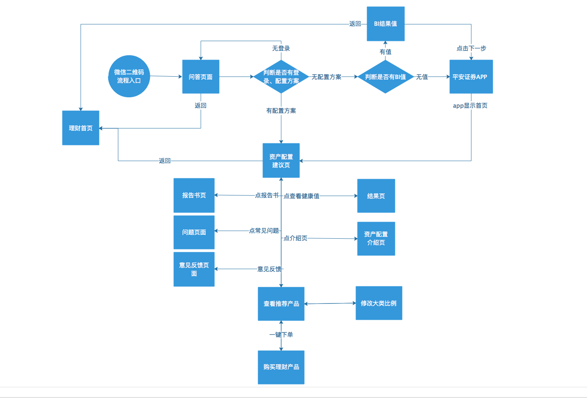
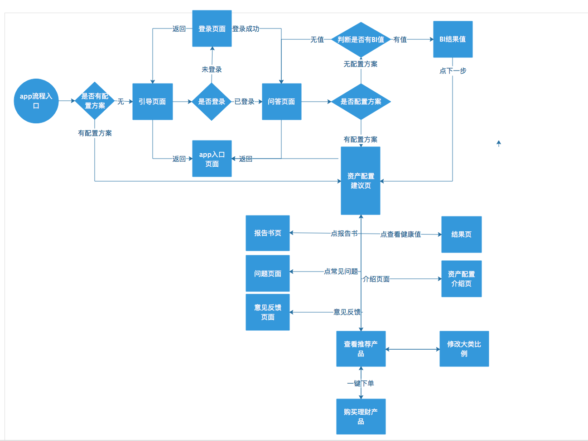

[TOC]


## 平安证券APP (UAT下载地址)

- [IOS 下载地址](fir.im/pazqiosuat)   fir.im/pazqiosuat
- [ANDROID 下载地址](fir.im/pazquat) fir.im/pazquat


## 项目入口

1. 首页 `->` 资产配置
2. 理财 `->` 我的资产 `->` 资产配置
3. 理财 `->` 更多 `->` 资产配置
4. 我的 `->` 安全型
5. 我的 `->` 资产明细 `->` 资产配置
6. 我的 `->` 增值服务 (更多) `->` 资产配置
7. 微信公众号 `->` 理财 `->` 理财产品 `->` 我的资产 `->` 资产配置
8. 微信公众号 `->` 理财 `->` 理财产品 `->` 我的资产 `->` 资产配置


## 常用地址

1. [uat 测试环境地址](https://stocklc.stg.pingan.com/spss-aa/mobile/index.html#/)：https://stocklc.stg.pingan.com/spss-aa/mobile/index.html#/
2. [prd 生产环境地址](https://asset.stock.pingan.com/mobile/index.html?_v=20170214173624#/)：https://asset.stock.pingan.com/mobile/index.html?_v=20170214173624#/
3. [后台接口文档地址](http://conf-stock.paic.com.cn:8080/pages/viewpage.action?pageId=1214320)：http://conf-stock.paic.com.cn:8080/pages/viewpage.action?pageId=1214320
4. [RAP文档地址](http://10.25.174.171:30074/platform/home.do)：http://10.25.174.171:30074/platform/home.do
5. [jenkins 打包发布地址](http://jenkins-stock.paic.com.cn:8080/view/PRISM_SPSS_AA/job/SPSS-AA-STATIC/ws/)：http://jenkins-stock.paic.com.cn:8080/view/PRISM_SPSS_AA/job/SPSS-AA-STATIC/ws/
6. [gitlab 地址(项目git库)](http://gitf-stock.paic.com.cn/spss_aa/aa_fe_h_cust/)：http://gitf-stock.paic.com.cn/spss_aa/aa_fe_h_cust/


## UAT测试账号

> 密码统一为：123123

| 资金账号         | usercode  | 手机号         | 用户类别 | 用户名  |
| ------------ | --------- | ----------- | ---- | ---- |
| 301719995038 | 189629942 | 15289250347 | 高门槛  | 占二六  |
| 301719995078 | 189629945 | 15289250348 | 高门槛  |      |
| 301719995045 | 189629931 | 15289250349 | 高门槛  |      |
| 301719995046 | 189630032 | 15289250350 | 高门槛  | 占二九  |
| 301719995089 | 189630041 | 15289250351 | 高门槛  |      |
| 301319992859 | 189627059 | 13110000039 | 高门槛  | 陈三十九 |
| 301319992969 | 189627060 | 13110000040 | 高门槛  |      |
| 301319992866 | 189627145 | 13110000043 | 高门槛  |      |


## 测试环境(uat) 打包发布

1. 进入 [jenkins 地址](http://jenkins-stock.paic.com.cn:8080/view/PRISM_SPSS_AA/job/SPSS-AA-STATIC/ws/)

2. Build with Parameters `->` BRANCH_TO_BUILD (输入 git 分支名称) `->` 开始构建

3. 工作空间 `->` build `->` output `->` uat `->` 打包下载全部文件

4. 把下载的全部文件通过 SSH Secure File Transfer(FTP) 上传到 uat 服务器上

   > uat 服务器信息如下
   >
   > ip: 10.25.164.177
   >
   > user: wls81
   >
   > pwd: Spss@1234
   >
   > 目录路径：/nfsc/spss_aa_data_vol1/spssaa_data/mobile

   ​


## 埋点信息设置

[http://conf-stock.paic.com.cn:8080/pages/viewpage.action?pageId=28688877](http://conf-stock.paic.com.cn:8080/pages/viewpage.action?pageId=28688877)


## 流程图

### 二维码



### APP




## 其他

1. 浏览器跨域

```javascript
// chrome 浏览器
open -a "Google Chrome" --args --disable-web-security  --user-data-dir

// windows 下的chrome浏览器 【保证关闭 chrome 浏览器的前提下运行】
1 进入 cmd 控制台
2 输入 "chrome浏览器地址" --args --disable-web-security  --user-data-dir
```

